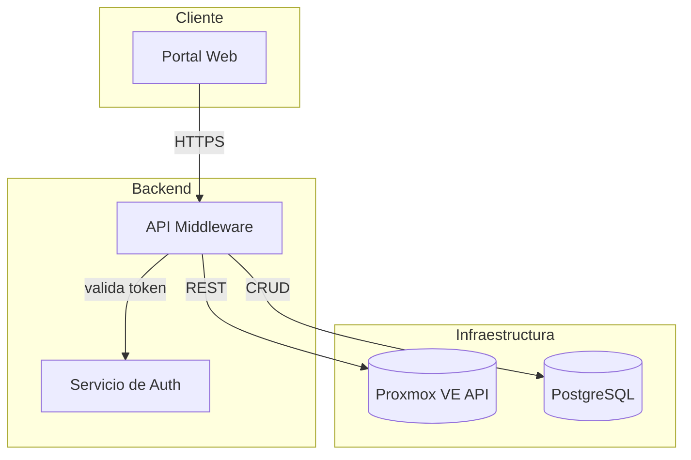

# Diagramas de Arquitectura de Código (Mermaid)

Esta skill genera diagramas de arquitectura en **Mermaid** a partir del código real del repo (no inventados), y los integra con el flujo de trabajo de **GitHub Spec Kit** cuando corresponde.

## Propósito

Estos diagramas no son un entregable formal ni decoración para la documentación: son **material de estudio**. Sirven para dos cosas concretas:

1. **Comprender la aplicación y el código a medida que avanza** — entender cómo se conecta lo que se acaba de implementar con el resto del sistema, no solo dejar constancia de que existe.
2. **Apoyar los code-review con los compañeros de equipo** (Albornoz, Armas, Bazán, Berrondo) — un diagrama claro ayuda a que quien revisa entienda el impacto de un cambio sin tener que leer todo el diff.

Esto condiciona cómo se hacen:

- Priorizar claridad y valor explicativo por sobre completitud. Es mejor un diagrama de 8 nodos que se entiende de un vistazo que uno de 20 que hay que estudiar para entender.
- Acompañar siempre el diagrama con una explicación breve en texto de **qué decisión de diseño o flujo está mostrando y por qué importa**, no solo qué contiene. Pensar "si esto lo lee un compañero en medio de un review, ¿le ahorra tiempo entender el cambio?".
- Cuando el diagrama sea sobre una feature ya revisada por code-review, marcar si refleja el estado ya aprobado o incluye cambios posteriores.

## Cuándo usarla

- **Solo cuando el usuario lo pide explícitamente.** No se dispara sola al terminar `/specify`, `/plan`, `/clarify`, `/tasks` ni ningún otro comando de Spec Kit. El criterio de "esto aporta valor visual" lo pone el usuario, no la skill.
- Típicamente esto pasa cuando ya cerró una spec (spec.md + plan.md + data-model.md están completos) y quiere un diagrama que la acompañe.
- También aplica si pide entender cómo se conecta un módulo con otro antes de tocar código, fuera del contexto de Spec Kit.

No la uses para peticiones triviales de una sola línea que no aportan valor visual (ej: "qué hace esta función").

## Workflow

### 1. Relevar el proyecto antes de dibujar nada

Nunca inventes componentes. Antes de generar el diagrama:

- Si el proyecto usa **Spec Kit**, la carpeta de la feature (`specs/NNN-nombre-feature/`) trae todo lo necesario, revisala en este orden:
  - `spec.md` → qué se construye y por qué (contexto funcional).
  - `plan.md` → decisiones técnicas y arquitectura propuesta.
  - `data-model.md` → entidades y relaciones (insumo directo para un `erDiagram` si aplica).
  - `research.md` → decisiones técnicas ya validadas, útil para no inventar tecnología.
  - `contracts/` → contratos de API/interfaces entre componentes (insumo para flechas y etiquetas del diagrama).
  - `tasks.md` → sirve para confirmar qué partes ya están implementadas vs. planeadas, así el diagrama no mezcla "lo que existe" con "lo que falta" sin aclararlo.
- Recorré la estructura real de carpetas (`src/`, `lib/`, `services/`, `apps/`, etc.) para identificar módulos, capas y límites (backend/frontend, API/DB, microservicios).
- Identificá las dependencias reales: imports entre módulos, llamadas a APIs externas, conexiones a bases de datos, colas, etc. Usá búsqueda de texto (grep) en vez de asumir.
- Si el repo es grande, no intentes mapear el 100%: priorizá el área sobre la que el usuario está preguntando o trabajando en ese momento.

### 2. Elegir el tipo de diagrama Mermaid correcto

| Necesidad | Tipo Mermaid |
|---|---|
| Arquitectura general / capas / módulos | `flowchart TD` o `graph TD` con `subgraph` por capa |
| Interacción entre servicios en el tiempo | `sequenceDiagram` |
| Modelo de datos / entidades | `erDiagram` |
| Estados de un proceso o workflow | `stateDiagram-v2` |
| Estructura de clases/interfaces | `classDiagram` |

Para arquitectura de sistema (el caso más común), usar `flowchart TD` con `subgraph` para agrupar por capa (ej: Cliente, API, Servicios, Persistencia).

### 3. Convenciones de estilo

- Dirección `TD` (top-down) por defecto, salvo que el flujo sea claramente horizontal (usar `LR` en ese caso).
- Nombrar nodos con IDs cortos en inglés/snake_case y labels descriptivos en español entre corchetes: `api_gw[API Gateway]`.
- Agrupar con `subgraph "Nombre de la capa"` cuando haya más de 4-5 nodos.
- Marcar bases de datos y colas con la forma cilíndrica: `db[(PostgreSQL)]`.
- Usar flechas con etiquetas cuando el tipo de comunicación importa: `api -->|REST| service`.
- No sobrecargar un solo diagrama: si hay más de ~15 nodos, dividir en varios diagramas (uno de alto nivel + uno de detalle por módulo).
- Mantené el diagrama fiel al código real. Si algo es una decisión de diseño propuesta (no implementada aún), aclaralo en el texto que acompaña al diagrama, no lo mezcles como si ya existiera.

### 4. Dónde entregar el resultado

- **Si el proyecto usa Spec Kit** (como en `trimIA`): guardar el diagrama dentro de `specs/NNN-nombre-feature/` como `architecture.md`, al mismo nivel que `spec.md`, `plan.md`, `data-model.md`, etc. Alternativa si el usuario lo pide: agregarlo directamente al final de `plan.md` en una sección `## Diagrama de Arquitectura`, envuelto en un bloque \`\`\`mermaid.
- **Si no hay Spec Kit**: preguntar si prefiere que quede en un archivo `docs/architecture.md` o simplemente mostrado en el chat.
- Siempre mostrar el diagrama también en la respuesta (bloque \`\`\`mermaid) para que se pueda ver sin abrir el archivo, si el visor lo soporta.

### 5. Después de generar

Agregá 2-3 líneas explicando qué representa el diagrama y qué supuestos tomaste (por ejemplo, "asumí que el middleware se comunica con Proxmox vía su API REST porque no encontré un cliente gRPC en el repo"). Si hay ambigüedad real sobre un componente, preguntá en vez de adivinar.

## Ejemplo de salida (referencia de formato)

