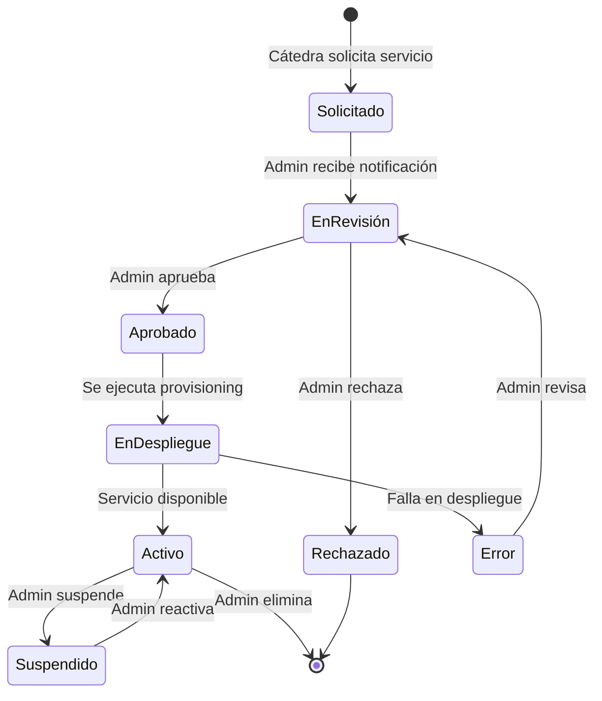
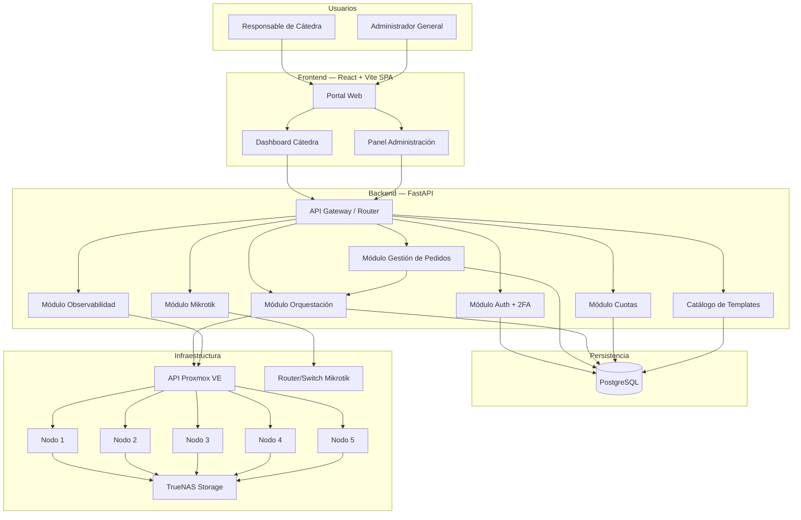
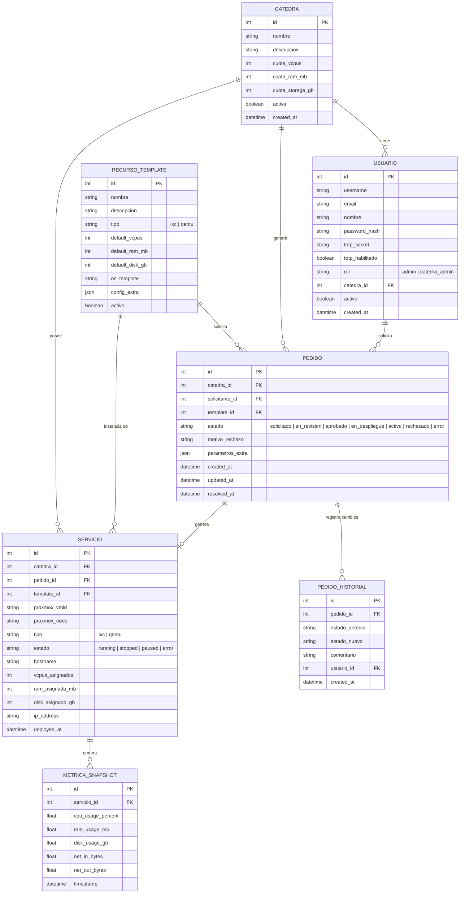

# Plan de Implementación: Software de Gestión y Orquestación de Servicios — Nube Privada UTN FRT

## Resumen del Contexto

### El Proyecto General
La cátedra de **Virtualización** de la UTN FRT está construyendo una **nube privada** para que las cátedras de la carrera puedan alojar y administrar servicios. El proyecto se divide en **3 prácticas supervisadas** complementarias:

| # | Responsable | Alcance |
|---|---|---|
| 1 | Ochoa, Alejandro | **Infraestructura**: Clúster Proxmox VE (5 nodos), configuración de dispositivos Mikrotik (router y switch) |
| 2 | **Mauro** | **Software de Gestión**: middleware/portal web, gestión de pedidos, entornos por cátedra, observabilidad |
| 3 | (Compañero 3) | **Almacenamiento Distribuido**: TrueNAS como storage compartido |

### Infraestructura Física
- **5 nodos físicos** con Proxmox VE, formando un clúster único
- **~8 GB RAM** y **~2 TB disco** por nodo (equipos limitados → prototipo funcional)
- **Networking**: Router Mikrotik + Switch Mikrotik
- **Almacenamiento**: TrueNAS (storage compartido para discos de todas las VMs/CTs)
- **Referencia de escala**: El profesor actualmente tiene ~100 contenedores en producción para la cátedra, corriendo en menos de 8 GB
- El software se desplegará como **contenedor LXC** dentro del clúster (máximo **8 GB de disco**, idealmente 4 GB)

### Decisiones ya tomadas

| Decisión | Resultado | Fuente |
|---|---|---|
| Frontend | **React + Vite** (SPA) | Mauro |
| Backend | **FastAPI** (Python) + **proxmoxer** | Mauro |
| Base de datos | **PostgreSQL** | Mauro |
| VMID por cátedra | **No se asignan rangos**. Proxmox gestiona IDs internamente, el software los mapea en su propia DB | Profesor |
| Autenticación | **Propia del software** (username + password + 2FA), no se usa el login de Proxmox | Profesor |
| Acceso a Proxmox | **El usuario nunca toca Proxmox**. El software es el único punto de contacto | Profesor |
| Dominio | Se usará el dominio existente (nap.frt) apuntando al portal | Profesor |
| Mikrotik | El portal debe contemplar la administración de dispositivos Mikrotik | Profesor |

### Restricciones
- **235 horas** en **10 semanas**
- Metodología **incremental e iterativa**
- Tener un prototipo funcional **antes de vacaciones de invierno**
- Disco máximo del contenedor: **8 GB** (regla del profesor: nunca más de 8 GB genéricos)
- Coordinación permanente con los compañeros de clúster y storage

---

## Entorno de Desarrollo Local

Para no depender del avance de los compañeros en la infraestructura física (clúster y almacenamiento), se utilizará una **VM local con Proxmox VE instalado** como entorno de desarrollo y pruebas. Esto permite trabajar con la **API real de Proxmox** desde el primer día sin esperar a que el clúster esté operativo.

### Setup

| Componente | Especificación |
|---|---|
| Hipervisor local | VirtualBox / VMware / KVM (con nested virtualization habilitada) |
| VM Proxmox VE | 4-8 GB RAM, 32 GB disco, 2-4 vCPUs |
| ISO | Proxmox VE (última versión estable) desde https://www.proxmox.com/en/downloads |
| Red | NAT o bridge para acceder a la web UI y a la API desde el host |

### Qué permite probar

- ✅ Conexión con `proxmoxer` y todos los endpoints de la API
- ✅ Creación/eliminación de contenedores LXC (no requiere nested virtualization)
- ✅ Monitoreo de recursos (CPU, RAM, disco) por contenedor
- ✅ Gestión del ciclo de vida (start, stop, restart)
- ✅ Templates de contenedores y flujo completo de provisioning
- ⚠️ VMs QEMU (requiere nested virtualization habilitada en el hipervisor)

### Transición a producción

Cuando el clúster real esté operativo, la migración es simplemente cambiar las variables de conexión en la configuración del backend:

```python
# .env — desarrollo
PROXMOX_HOST=192.168.1.X  # IP de la VM local
PROXMOX_USER=root@pam
PROXMOX_TOKEN_NAME=dev-token
PROXMOX_TOKEN_VALUE=xxxx

# .env — producción
PROXMOX_HOST=nap.frt      # Clúster real
PROXMOX_USER=software@pve
PROXMOX_TOKEN_NAME=api-token
PROXMOX_TOKEN_VALUE=yyyy
```

> [!TIP]
> Esta VM local también sirve para las demos y la presentación ante el profesor, sin necesidad de que el clúster físico esté disponible en ese momento.

---

## Concepto Central: Middleware de Gestión

El software actúa como un **portal intermediario** entre los usuarios (responsables de cátedra) y la infraestructura (Proxmox VE, TrueNAS, Mikrotik). La premisa fundamental definida por el profesor:

> *"Olvidémonos de Proxmox. Proxmox va a ser nuestro back. El software tiene que gestionar todo."*
>
> *"La idea es pensar en un middleware, un software intermediando todos los recursos con que vamos a contar."*

### Flujo de Gestión de Pedidos (estilo AWS)

El profesor indicó explícitamente que el software debe funcionar como un **sistema de gestión de pedidos** con **transición de estados** visibles para el usuario, similar a cómo AWS muestra el progreso cuando se crea una VPS:



El usuario puede **ver en qué estado está** su pedido en todo momento.

### Roles del Sistema

| Rol | Permisos |
|---|---|
| **Administrador General** | Gestiona accesos, aprueba pedidos, define cuotas, monitorea todo, administra templates, configura Mikrotik |
| **Responsable de Cátedra** | Solicita servicios, ve estado de sus pedidos, monitorea sus recursos, administra sus servicios activos |

---

## Stack Tecnológico

### Backend: Python + FastAPI + proxmoxer

| Componente | Tecnología | Justificación |
|---|---|---|
| Framework web | **FastAPI** | Liviano, async, autodocumentación OpenAPI, ideal para APIs REST |
| Cliente Proxmox | **proxmoxer** | Wrapper oficial de la API de Proxmox VE, mapeo directo de endpoints |
| ORM / DB | **SQLAlchemy** + **PostgreSQL** | Persistir usuarios, cátedras, pedidos, cuotas, templates, métricas |
| Migraciones | **Alembic** | Migraciones versionadas del esquema de BD |
| Autenticación | **JWT** (python-jose) + **TOTP** (pyotp) para 2FA | Autenticación propia con tokens, sin depender de Proxmox |
| Tareas en background | **APScheduler** o **Celery + Redis** | Polling de métricas, despliegues async, notificaciones |
| Validación | **Pydantic v2** (incluido en FastAPI) | Schemas tipados para requests/responses |
| Cliente Mikrotik | **routeros-api** o **librouteros** | Integración con router/switch Mikrotik |

### Frontend: React + Vite

| Componente | Tecnología | Justificación |
|---|---|---|
| Framework UI | **React 18** + **Vite** | SPA moderna, build ultra-rápido, HMR |
| Routing | **React Router v6** | Navegación client-side |
| State management | **TanStack Query** (React Query) | Cache y sincronización de datos server-side |
| HTTP Client | **Axios** | Comunicación con el backend FastAPI |
| UI Kit | **Shadcn/ui** + **Tailwind CSS** | Componentes enterprise-grade, accesibles, personalizables |
| Gráficos | **Recharts** | Dashboards de observabilidad |
| Formularios | **React Hook Form** + **Zod** | Validación client-side |

### Despliegue
- **Contenedor LXC** dentro del clúster Proxmox (≤ 8 GB disco)
- **Nginx** como reverse proxy (sirve el frontend estático y proxea la API)
- **PostgreSQL** en el mismo contenedor o en un contenedor separado
- Dominio: **nap.frt** → apunta al portal

---

## Arquitectura



### Módulos Principales

#### 1. **Módulo de Autenticación y Autorización** (`auth`)
- Login con JWT tokens (usuario + contraseña)
- Autenticación de dos factores (2FA / TOTP)
- Roles predefinidos: `admin` (administrador general), `catedra_admin` (responsable de cátedra)
- El software crea y gestiona todos los usuarios (no Proxmox)
- Cada cátedra = un "tenant" aislado con su propio espacio
- Evaluación futura: integración con correo institucional (OAuth2 / LDAP)

#### 2. **Módulo de Gestión de Pedidos** (`requests`)
- Flujo completo de solicitud de servicio con máquina de estados
- Estados: `solicitado` → `en_revisión` → `aprobado` → `en_despliegue` → `activo` (o `rechazado` / `error`)
- Notificaciones al administrador cuando hay pedidos nuevos
- El usuario ve la transición de estados en tiempo real (como AWS)
- Historial completo de pedidos por cátedra
- Al aprobarse, se dispara automáticamente el provisioning vía el módulo de orquestación

#### 3. **Módulo de Orquestación** (`orchestration`)
- Wrapper sobre `proxmoxer` para:
  - Crear/eliminar/configurar VMs y contenedores LXC
  - Gestionar ciclo de vida (start, stop, restart, migrate)
- El VMID lo asigna Proxmox automáticamente; el software lo relaciona internamente
- Validación de cuotas antes de cada operación
- Ejecución asíncrona del despliegue (no bloquea la UI)

#### 4. **Módulo de Gestión de Cátedras y Cuotas** (`tenants`)
- CRUD de cátedras con sus configuraciones
- Definición de **cuotas de recursos** por cátedra:
  - Cuota de vCPUs
  - Cuota de RAM (MB)
  - Cuota de almacenamiento (GB)
- Los límites deben definirse en función de las capacidades reales (~8 GB por nodo, 5 nodos)

> [!NOTE]
> Proxmox VE **no soporta cuotas duras nativas** en pools. El software implementa una capa de validación que consulta el uso actual antes de aprobar cada solicitud. Este es el valor agregado principal del software.

#### 5. **Módulo de Templates / Catálogo** (`catalog`)
- **Templates de recursos estandarizados** adaptados a la infraestructura:
  - Ej: "Contenedor Básico: 1 vCPU, 256 MB RAM, 2 GB disco"
  - Ej: "Servidor Web: 1 vCPU, 512 MB RAM, 4 GB disco, Nginx preinstalado"
  - Ej: "Base de Datos: 1 vCPU, 512 MB RAM, 4 GB disco, PostgreSQL"
- Templates con asignaciones mínimas (hay que ser conservadores con los recursos)
- Las cátedras eligen de este catálogo al hacer su pedido
- El administrador puede crear/editar templates

> [!NOTE]
> El profesor enfatizó: *"Tenemos que definir los límites. Hasta cuánto le podemos dar a una cátedra y qué le podemos dar."* Los templates siguen la filosofía de asignaciones mínimas: vCPUs compartidas, RAM mínima, disco ≤ 8 GB por servicio.

#### 6. **Módulo de Observabilidad** (`monitoring`)
- Polling periódico de métricas vía API de Proxmox:
  - CPU, RAM, disco, red por VM/CT
  - Estado de servicios (running, stopped, paused)
  - Estado de los nodos del clúster
- Dashboard con gráficos por cátedra (el responsable ve sus propios recursos)
- Panel global del administrador (ve todo el clúster)
- Alertas básicas (uso > umbral, servicio caído)

#### 7. **Módulo Mikrotik** (`mikrotik`) — *evaluación de viabilidad*
- Integración con la API REST de RouterOS para:
  - Visualizar estado de interfaces y rutas
  - Gestión básica de reglas de firewall
  - Monitoreo de tráfico de red
- Este módulo se evalúa en la semana 7-8 según disponibilidad

---

## Modelo de Datos



---

## Estructura de Proyecto

```
PS/
├── docs/                          # Documentación del proyecto
├── backend/
│   ├── app/
│   │   ├── __init__.py
│   │   ├── main.py                # FastAPI app entry point
│   │   ├── config.py              # Settings (Pydantic BaseSettings)
│   │   ├── database.py            # SQLAlchemy engine & session
│   │   ├── models/                # SQLAlchemy models
│   │   │   ├── catedra.py
│   │   │   ├── usuario.py
│   │   │   ├── recurso_template.py
│   │   │   ├── pedido.py
│   │   │   ├── servicio.py
│   │   │   └── metrica.py
│   │   ├── schemas/               # Pydantic schemas (request/response)
│   │   │   ├── auth.py
│   │   │   ├── catedra.py
│   │   │   ├── pedido.py
│   │   │   ├── servicio.py
│   │   │   └── monitoreo.py
│   │   ├── routers/               # API endpoints por módulo
│   │   │   ├── auth.py
│   │   │   ├── catedras.py
│   │   │   ├── pedidos.py
│   │   │   ├── servicios.py
│   │   │   ├── catalogo.py
│   │   │   ├── monitoreo.py
│   │   │   └── mikrotik.py
│   │   ├── services/              # Lógica de negocio
│   │   │   ├── proxmox_client.py  # Wrapper sobre proxmoxer
│   │   │   ├── orchestrator.py    # Lógica de orquestación/provisioning
│   │   │   ├── quota_manager.py   # Validación de cuotas
│   │   │   ├── pedido_manager.py  # Máquina de estados de pedidos
│   │   │   ├── monitor.py         # Recolección de métricas
│   │   │   └── mikrotik_client.py # Integración Mikrotik
│   │   └── utils/
│   │       ├── security.py        # JWT, hashing, TOTP
│   │       └── notifications.py   # Sistema de notificaciones
│   ├── alembic/                   # Migraciones DB
│   ├── tests/
│   ├── requirements.txt
│   └── Dockerfile
├── frontend/                      # SPA React + Vite
│   ├── src/
│   │   ├── components/            # Componentes reutilizables
│   │   ├── pages/                 # Páginas/vistas
│   │   │   ├── Login.jsx
│   │   │   ├── Dashboard.jsx      # Dashboard cátedra
│   │   │   ├── AdminPanel.jsx     # Panel administración
│   │   │   ├── NuevoPedido.jsx    # Formulario solicitud
│   │   │   ├── MisPedidos.jsx     # Seguimiento de pedidos
│   │   │   ├── MisServicios.jsx   # Servicios activos
│   │   │   └── Monitoreo.jsx      # Gráficos y métricas
│   │   ├── hooks/                 # Custom hooks
│   │   ├── services/              # Llamadas a API (Axios)
│   │   └── App.jsx
│   ├── package.json
│   └── vite.config.js
└── docker-compose.yml             # Para desarrollo local
```

---

## Integración con Proxmox VE vía `proxmoxer`

### Conexión base

```python
from proxmoxer import ProxmoxAPI

class ProxmoxClient:
    def __init__(self, host: str, user: str, token_name: str, token_value: str):
        self.api = ProxmoxAPI(
            host,
            user=user,
            token_name=token_name,
            token_value=token_value,
            verify_ssl=False
        )

    def get_nodes(self) -> list:
        return self.api.nodes.get()

    def get_node_status(self, node: str) -> dict:
        return self.api.nodes(node).status.get()

    def create_lxc(self, node: str, **kwargs) -> str:
        """Crea un contenedor LXC. Proxmox asigna el VMID."""
        return self.api.nodes(node).lxc.create(**kwargs)

    def get_vm_status(self, node: str, vmid: int, vm_type: str = "qemu") -> dict:
        if vm_type == "lxc":
            return self.api.nodes(node).lxc(vmid).status.current.get()
        return self.api.nodes(node).qemu(vmid).status.current.get()

    def get_cluster_resources(self) -> list:
        return self.api.cluster.resources.get()
```

### Validación de cuotas

```python
class QuotaManager:
    def __init__(self, proxmox_client: ProxmoxClient, db_session):
        self.pve = proxmox_client
        self.db = db_session

    async def can_deploy(self, catedra_id: int, requested_vcpus: int,
                         requested_ram_mb: int, requested_disk_gb: int) -> bool:
        """Valida que la cátedra no exceda sus cuotas antes de aprobar un despliegue."""
        catedra = self.db.query(Catedra).get(catedra_id)
        current_usage = self._get_current_usage(catedra)

        return (
            current_usage.vcpus + requested_vcpus <= catedra.cuota_vcpus
            and current_usage.ram_mb + requested_ram_mb <= catedra.cuota_ram_mb
            and current_usage.disk_gb + requested_disk_gb <= catedra.cuota_storage_gb
        )

    def _get_current_usage(self, catedra):
        """Consulta los servicios activos de la cátedra y suma su consumo real."""
        servicios = self.db.query(Servicio).filter(
            Servicio.catedra_id == catedra.id,
            Servicio.estado == "running"
        ).all()
        return ResourceUsage(
            vcpus=sum(s.vcpus_asignados for s in servicios),
            ram_mb=sum(s.ram_asignada_mb for s in servicios),
            disk_gb=sum(s.disk_asignado_gb for s in servicios),
        )
```

### Gestión de pedidos (máquina de estados)

```python
class PedidoManager:
    TRANSICIONES_VALIDAS = {
        "solicitado": ["en_revision", "rechazado"],
        "en_revision": ["aprobado", "rechazado"],
        "aprobado": ["en_despliegue"],
        "en_despliegue": ["activo", "error"],
        "error": ["en_revision"],
        "activo": ["suspendido"],
        "suspendido": ["activo"],
    }

    async def cambiar_estado(self, pedido_id: int, nuevo_estado: str,
                              usuario_id: int, comentario: str = ""):
        pedido = self.db.query(Pedido).get(pedido_id)

        if nuevo_estado not in self.TRANSICIONES_VALIDAS.get(pedido.estado, []):
            raise ValueError(f"Transición inválida: {pedido.estado} → {nuevo_estado}")

        estado_anterior = pedido.estado
        pedido.estado = nuevo_estado
        pedido.updated_at = datetime.utcnow()

        # Registrar en historial
        historial = PedidoHistorial(
            pedido_id=pedido.id,
            estado_anterior=estado_anterior,
            estado_nuevo=nuevo_estado,
            comentario=comentario,
            usuario_id=usuario_id,
        )
        self.db.add(historial)

        # Si se aprueba, disparar provisioning
        if nuevo_estado == "aprobado":
            await self._iniciar_despliegue(pedido)

        self.db.commit()
```

---

## Cronograma Detallado (Alineado con Plan de Trabajo)

| Semana | Fase | Entregables Concretos | Horas |
|--------|------|----------------------|-------|
| **1** | Investigación y relevamiento | Documento de requerimientos, PoC con `proxmoxer` conectando al clúster, análisis de APIs Mikrotik, benchmarks de UX (AWS/GCloud) | 20 |
| **2** | Diseño de arquitectura | Diagrama de arquitectura final, modelo de datos PostgreSQL, diseño de API (OpenAPI spec), wireframes del portal, diseño del flujo de estados | 25 |
| **3-4** | Backend y orquestación | Proyecto FastAPI, conexión PostgreSQL + Alembic, sistema auth + 2FA, CRUD cátedras/cuotas, `ProxmoxClient` wrapper, módulo de pedidos con máquina de estados, catálogo de templates, tests | 45 |
| **5-6** | Frontend (portal web) | Proyecto React+Vite, pantallas de auth, dashboard de cátedra, panel de administración, formulario de solicitud, visualización de estados de pedidos, integración con API | 40 |
| **7** | PaaS/SaaS | Flujo completo solicitud→aprobación→despliegue automatizado, templates preconfigurados, provisioning real sobre Proxmox | 20 |
| **8** | Observabilidad + Mikrotik | Módulo de monitoreo (polling métricas), gráficos en dashboards, alertas básicas, evaluación integración Mikrotik | 15 |
| **9** | Pruebas integrales | Tests E2E con clúster real + TrueNAS, prueba de flujo completo con cátedra simulada, ajustes, corrección de errores | 35 |
| **10** | Documentación | Informe técnico, manual de uso (cátedra), manual de administración, documentación de API, recomendaciones futuras | 35 |
| | | **Total** | **235** |

---

## Pendientes a Definir

> [!NOTE]
> ### 1. Nombre del Software
> Todavía no hay nombre definido. Opciones a considerar: **"CloudFRT"**, **"NubeUTN"**, **"ProxPanel"**, **"NAP Portal"**, o algo que el equipo proponga.

> [!NOTE]
> ### 2. Servicios concretos para el catálogo
> Hay que definir con el profesor qué servicios específicos van a ofrecer las cátedras. Actualmente es "abierto" según la entrevista. Se definirá en la semana 1 de relevamiento.

> [!NOTE]
> ### 3. Acceso al clúster para pruebas
> Verificar con Alejandro cuándo estarán operativos los nodos para las pruebas de integración real. Mientras tanto, desarrollo y pruebas en entorno local/simulado.

> [!NOTE]
> ### 4. Credenciales de API Proxmox
> Necesitamos un **API Token** dedicado con permisos suficientes. Coordinar con Alejandro o el profesor.

> [!NOTE]
> ### 5. Autenticación institucional
> La integración con correo institucional (OAuth2/LDAP) queda como evaluación futura, no es prioridad para el prototipo.

---

## Verificación

### Tests Automatizados
- Tests unitarios con `pytest` para cada módulo del backend
- Tests de integración con mock de la API de Proxmox (`unittest.mock`)
- Tests del flujo de estados de pedidos (todas las transiciones válidas e inválidas)
- Tests E2E contra el clúster real en la semana 9

### Verificación Manual
- Demo del portal web funcionando (login → solicitud → aprobación → despliegue → monitoreo)
- Validación de que las cuotas se respetan correctamente (no se puede desplegar si se excede)
- Prueba con múltiples cátedras simultáneas
- Prueba de caída de servicio + alerta
- Validación del flujo de estados completo con el profesor
