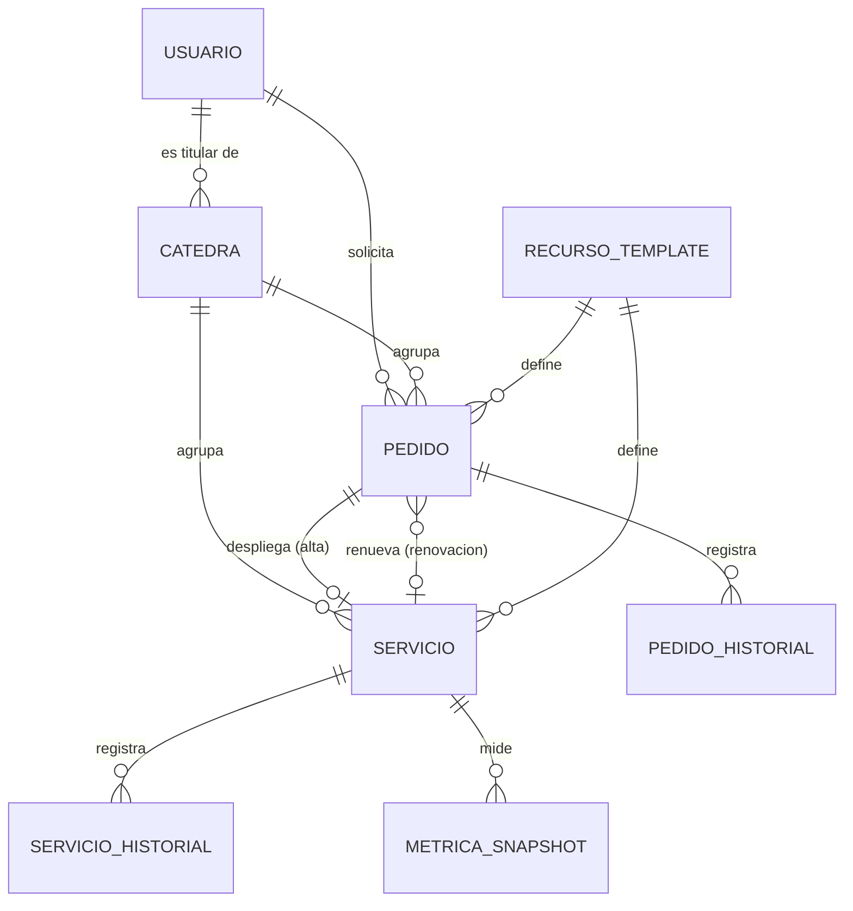

# Data Model: Unificación usuario–cátedra y control de recursos por aprobación

**Feature**: 004-unificar-usuario-catedra | **Fecha**: 2026-08-16

Fase 1 del plan. Deriva de [spec.md](./spec.md) y de las decisiones de [research.md](./research.md).

---

## Cambios por entidad

### `usuarios` — la persona deja de estar atada a una cátedra

| Campo | Cambio | Motivo |
|---|---|---|
| `catedra_id` | **Se elimina** (en migración diferida) | La relación se invierte: ahora la cátedra apunta a su titular (R8) |

El resto de la entidad no cambia. `rol` sigue siendo `admin` \| `catedra_admin`.

**Relación nueva**: `Usuario.catedras: list[Catedra]` (uno a muchos, `back_populates="titular"`).

---

### `catedras` — pierde la cuota, gana un titular

| Campo | Cambio | Notas |
|---|---|---|
| `titular_id` | **Nuevo** — FK `usuarios.id`, nullable | Nullable solo durante la migración; al terminar, toda cátedra activa tiene titular (FR-008) |
| `cuota_vcpus` | **Se elimina** | FR-010 |
| `cuota_ram_mb` | **Se elimina** | FR-010 |
| `cuota_storage_gb` | **Se elimina** | FR-010 |
| `nombre` | **Deja de ser único global** → único por `(titular_id, nombre)` | FR-002: dos titulares pueden dictar materias homónimas |

**Reglas de validación**:

- Una cátedra `activa` con servicios vigentes MUST tener `titular_id` no nulo (FR-008).
- Desactivar un usuario con cátedras a cargo se rechaza hasta reasignarlas o darlas de baja (FR-008).
- Al reasignar `titular_id`, los pedidos, servicios e historial **no se tocan**: pertenecen a la
  cátedra (FR-006).

---

### `pedidos` — suma tipo y compromiso de capacidad

| Campo | Cambio | Notas |
|---|---|---|
| `tipo` | **Nuevo** — enum `alta` \| `renovacion`, default `alta` | R11 |
| `servicio_id` | **Nuevo** — FK `servicios.id`, nullable | Solo en `tipo=renovacion`: el servicio que se renueva |
| `reserva_vcpus` | **Nuevo** — int, default 0 | Capacidad comprometida al aprobar (R3) |
| `reserva_ram_mb` | **Nuevo** — int, default 0 | Ídem |
| `reserva_disk_gb` | **Nuevo** — int, default 0 | Ídem |
| `reserva_expira_at` | **Nuevo** — datetime nullable | FR-018d; se fija al aprobar |
| `justificacion_capacidad` | **Nuevo** — text nullable | FR-015b; obligatorio si se aprueba sobrecomprometiendo |

**Reglas de validación**:

- La creación de un pedido MUST NOT verificar consumo acumulado de la cátedra (FR-009). Se elimina
  la llamada a `verificar_cuota` de `crear_pedido`.
- `catedra_id` MUST pertenecer al conjunto de cátedras del solicitante (FR-004, FR-035).
- Al aprobar un pedido `tipo=alta`, los tres campos `reserva_*` se copian **desde el template**, no
  se referencian (R3).
- Un pedido `tipo=renovacion` MUST dejar los `reserva_*` en 0 (R11): el servicio ya cuenta como
  consumo desplegado.
- `justificacion_capacidad` MUST ser no nulo cuando la aprobación excede la capacidad libre
  (FR-015b).

**Definición de reserva vigente** (no es una columna; es la condición que usa el cálculo de
capacidad):

```
estado = APROBADO
  AND deleted_at IS NULL
  AND tipo = 'alta'
  AND NOT EXISTS (servicio del pedido)
  AND (reserva_expira_at IS NULL OR reserva_expira_at > ahora)
```

---

### `pedidos_historial` — admite al sistema como autor

| Campo | Cambio | Notas |
|---|---|---|
| `usuario_id` | `NOT NULL` → **nullable** | `NULL` = el sistema (R4, Principio II v2.0.0) |

Sigue siendo de solo agregado (Principio V).

---

### `servicios` — vencimiento y pausado

| Campo | Cambio | Notas |
|---|---|---|
| `vence_at` | **Nuevo** — datetime nullable | FR-018f. Nullable solo para los preexistentes a la migración |
| `aviso_vencimiento_at` | **Nuevo** — datetime nullable | Cuándo se avisó del vencimiento (R9) |
| `exento_pausado` | **Nuevo** — bool, default `false` | FR-026 "siempre encendido" |
| `pausa_programada_at` | **Nuevo** — datetime nullable | Fin del período de gracia; `NULL` = sin pausa programada |
| `aviso_pausa_at` | **Nuevo** — datetime nullable | Cuándo se avisó de la pausa (FR-020) |
| `pausado_auto_at` | **Nuevo** — datetime nullable | Desde cuándo lo pausó el sistema (FR-030) |

**Reglas de validación**:

- `pausado_auto_at` no nulo MUST impedir que `sincronizar_estados` sobrescriba `estado = PAUSED`
  con el `stopped` que reporta Proxmox (R7).
- Reactivar un servicio MUST limpiar `pausado_auto_at`, `pausa_programada_at` y `aviso_pausa_at`.
- Registrar actividad durante la gracia MUST limpiar `pausa_programada_at` y `aviso_pausa_at`
  (FR-021).
- `exento_pausado = true` MUST excluir al servicio del pausado automático, pero **no** del
  vencimiento (FR-026 exime de lo primero, no de lo segundo).
- Un servicio con renovación pendiente de resolver MUST NOT apagarse por vencimiento (FR-018m).

---

### `servicios_historial` — tabla nueva

Misma forma que `pedidos_historial` (R5), de solo agregado.

| Campo | Tipo | Notas |
|---|---|---|
| `id` | int PK | |
| `servicio_id` | FK `servicios.id`, no nulo | |
| `estado_anterior` | str(20), no nulo | |
| `estado_nuevo` | str(20), no nulo | |
| `comentario` | text nullable | El motivo: "sin uso desde <fecha>", "vencido el <fecha>" |
| `usuario_id` | FK `usuarios.id`, **nullable** | `NULL` = el sistema |
| `created_at` | datetime | |

Registra: encendido/apagado/reinicio manual (feature 003, hoy sin rastro), pausa y reactivación
automática (FR-029), y vencimiento (FR-018l).

---

### `migracion_004_accesos_perdidos` — tabla nueva, de bitácora

FR-034 (R8). Constancia de quién perdió acceso al pasar a titular único.

| Campo | Tipo |
|---|---|
| `id` | int PK |
| `usuario_id` | FK `usuarios.id` |
| `username` | str(50) — copia, sobrevive al borrado del usuario |
| `catedra_id` | FK `catedras.id` |
| `catedra_nombre` | str(100) — copia |
| `migrado_at` | datetime |

Solo lectura desde la aplicación; la escribe la migración.

---

### `job_locks` — tabla nueva, de exclusión

R1. Impide que los trabajos periódicos se ejecuten en paralelo con varios workers.

| Campo | Tipo | Notas |
|---|---|---|
| `nombre` | str(50) PK | `expirar_reservas`, `aplicar_vencimientos`, `evaluar_inactividad`, `recolectar_metricas` |
| `tomado_at` | datetime | |
| `tomado_por` | str(100) nullable | Identificador del proceso, para diagnóstico |

---

## Máquina de estados

### Pedido — sin estados nuevos

`TRANSICIONES_VALIDAS` no cambia. Lo que cambia es el **ejecutor** de `EN_DESPLIEGUE → ACTIVO`,
que se selecciona por `Pedido.tipo` (R11):

| Tipo | Ejecutor | Efecto |
|---|---|---|
| `alta` | El orquestador actual | Crea el contenedor y el `Servicio` |
| `renovacion` | Ejecutor nuevo | Corre `Servicio.vence_at`; no toca Proxmox |

Transiciones nuevas ejecutadas por el sistema (autor `NULL`):

| Transición | Disparador | Requisito |
|---|---|---|
| `APROBADO → RECHAZADO` | Vencimiento de la reserva | FR-018d |

> **Nota para `/speckit-tasks`**: `APROBADO → RECHAZADO` **no está** hoy en
> `TRANSICIONES_VALIDAS` ([pedido_service.py:19](../../backend/app/services/pedido_service.py#L19)),
> que solo permite `APROBADO → EN_DESPLIEGUE`. Hay que agregarla junto con su ejecutor, o la
> expiración de reservas viola el Principio II. Es la clase de desajuste tabla/ejecutor que el
> principio existe para detectar.

### Servicio — sin estados nuevos

`EstadoServicio` mantiene `RUNNING`, `STOPPED`, `PAUSED`, `ERROR`. Transiciones nuevas por el
sistema:

| Transición | Disparador | Marca | Requisito |
|---|---|---|---|
| `RUNNING → PAUSED` | Inactividad, vencida la gracia | `pausado_auto_at` | FR-019, FR-022 |
| `PAUSED → RUNNING` | Reactivación por la cátedra | limpia marcas | FR-024 |
| `RUNNING → PAUSED` | Vencimiento sin renovación | `vence_at` alcanzado | FR-018k |

Una reactivación que falla por capacidad MUST dejar el servicio en `PAUSED`, nunca en `ERROR`
(FR-025).

---

## Cálculo de capacidad

Fuente única, en `app/services/capacidad_service.py`. Reemplaza a `verificar_cuota`
([pedido_service.py:56](../../backend/app/services/pedido_service.py#L56)) y a
`_cuotas_comprometidas` ([catedras.py:34](../../backend/app/routers/catedras.py#L34)).

| Magnitud | Definición |
|---|---|
| **Capacidad física** | Nodos `online` del clúster. Reutiliza `_capacidad_cluster` ([catedras.py:24](../../backend/app/routers/catedras.py#L24)) |
| **Desplegado** | Servicios vigentes (`deleted_at IS NULL`): vCPU y RAM solo si `estado = RUNNING`; disco **siempre**, incluso pausados (FR-031) |
| **Reservado** | Suma de `reserva_*` de las reservas vigentes (definición arriba) — FR-014b |
| **Comprometido** | Desplegado + Reservado |
| **Libre** | Física − Comprometido |
| **RAM en riesgo** | Suma de `ram_asignada_mb` de los servicios en `PAUSED` vigentes — FR-014c |

**Token de capacidad** (R2): hash corto y estable de `(comprometido.vcpus, comprometido.ram_mb,
comprometido.storage_gb)`. Viaja en la respuesta de la pantalla de aprobación y vuelve en la
confirmación.

---

## Diagrama de relaciones



La cátedra —no la persona— es dueña de pedidos y servicios: es lo que permite reasignar el titular
sin perder la historia (FR-006, Principio V).

---

## Secuencia de migraciones

Cuatro revisiones de Alembic, en este orden. La separación existe para que cada paso sea
reversible; una sola migración monolítica no permitiría volver atrás sin pérdida.

| # | Revisión | Contenido | Reversible |
|---|---|---|---|
| 1 | `..._titular_catedra` | Agrega `catedras.titular_id`; puebla con el menor `usuarios.id` asignado; crea y llena `migracion_004_accesos_perdidos` | Sí |
| 2 | `..._capacidad_y_vencimiento` | Columnas nuevas en `pedidos` y `servicios`; `pedidos_historial.usuario_id` nullable; tablas `servicios_historial` y `job_locks` | Sí |
| 3 | `..._quitar_cuotas` | Elimina `cuota_vcpus`, `cuota_ram_mb`, `cuota_storage_gb`; cambia la unicidad de `catedras.nombre` a `(titular_id, nombre)` | Sí (con valores por defecto) |
| 4 | `..._quitar_usuario_catedra` | Elimina `usuarios.catedra_id` | Sí |

**Datos preexistentes**:

- `servicios.vence_at` queda en `NULL` para los servicios que ya existen. Un servicio sin
  vencimiento **no** se apaga; el administrador les asigna fecha desde el panel. Apagar por
  vencimiento a un servicio que nunca supo que tenía fecha violaría FR-018g y el Principio VI.
- Ningún servicio preexistente entra al pausado automático durante la primera ventana, por la regla
  de cobertura mínima de R6. FR-033 queda cubierto sin código especial.

---

## Trazabilidad requisito → modelo

| Requisito | Dónde se resuelve |
|---|---|
| FR-001, FR-001b | `catedras.titular_id` |
| FR-002 | Unicidad `(titular_id, nombre)` |
| FR-003, FR-004 | `acceso_service.catedras_visibles` (R10) |
| FR-006 | Pedidos y servicios cuelgan de `catedra_id`, no de `usuario_id` |
| FR-008 | Validación de titular al desactivar usuario |
| FR-009 | Se quita `verificar_cuota` de `crear_pedido` |
| FR-010 | Se eliminan las tres columnas de cuota |
| FR-012 | `servicios_historial` + soft delete existente |
| FR-014b | "Reservado" en el cálculo de capacidad |
| FR-014c | "RAM en riesgo" |
| FR-015b | `pedidos.justificacion_capacidad` |
| FR-018b–e | Columnas `reserva_*` + advisory lock + token |
| FR-018f–n | `servicios.vence_at` y afines; `pedidos.tipo` |
| FR-019–031 | Marcas de pausa en `servicios`; `servicios_historial` |
| FR-029, FR-018l | `usuario_id` nullable en ambos historiales |
| FR-033, FR-034 | Regla de cobertura (R6); `migracion_004_accesos_perdidos` |
| FR-035–036c | Endpoint de alta transaccional (ver [contracts/](./contracts/)) |
